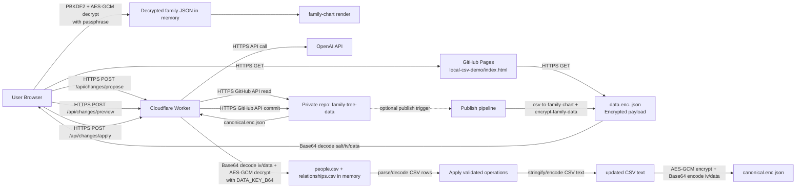

# Family Tree Architecture

This project has two data paths:
- `Read/visualize` path for the public GitHub Pages app.
- `Edit/apply` path through Cloudflare Worker to a private encrypted canonical store.

## System Diagram

## Where Security + Encoding Happen

- In flight:
  - Browser ↔ GitHub Pages: HTTPS (TLS).
  - Browser ↔ Worker: HTTPS (TLS) + `Authorization: Bearer <API_TOKEN>` for mutating endpoints.
  - Worker ↔ GitHub/OpenAI: HTTPS (TLS).

- At rest:
  - Private canonical store: `canonical.enc.json` is AES-GCM encrypted (key: `DATA_KEY_B64` in Worker secrets).
  - Public visualization payload: `data.enc.<version>.json` is AES-GCM encrypted with passphrase-derived key (PBKDF2).

- Encode/decode:
  - Encrypted binary fields (`salt`, `iv`, `ciphertext`) are Base64-encoded in JSON envelopes.
  - CSV is decoded (parse) to row objects in memory, then encoded (stringify) back to CSV before commit.
